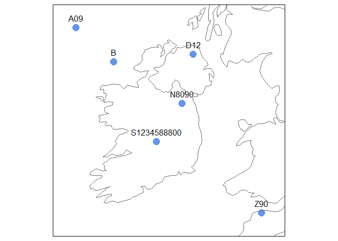

<!-- README.md is generated from README.Rmd. Please edit that file -->

# igr

<!-- badges: start -->

[](https://lifecycle.r-lib.org/articles/stages.html#experimental)
[](https://CRAN.R-project.org/package=igr)
[](https://github.com/digitalnature-ie/igr/actions/workflows/R-CMD-check.yaml)
[](https://github.com/digitalnature-ie/igr/actions/workflows/test-coverage.yaml)
<!-- badges: end -->

Convert Irish Grid References to Irish Grid coordinates or a simple
feature object in any coordinate reference system, and vice versa.

## Installation

You can install the development version of igr like so:

``` r
# FILL THIS IN! HOW CAN PEOPLE INSTALL YOUR DEV PACKAGE?
```

## Converting from Irish Grid References

Convert Irish Grid References to Irish Grid coordinates:

``` r
library(igr)

igrs <- c("A09", "B", "D12", "N8090", "S1234588800", "Z90")

igr_to_ig(igrs)
#> $x
#> [1]      0 100000 310000 280000 212345 490000
#> 
#> $y
#> [1] 490000 400000 420000 290000 188800      0
```

Convert Irish Grid References to an sf object with Irish Grid coordinate
reference system:

``` r
p_sf <- st_igr_as_sf(data.frame(igr = igrs), "igr")

p_sf
#> Simple feature collection with 6 features and 1 field
#> Geometry type: POINT
#> Dimension:     XY
#> Bounding box:  xmin: 0 ymin: 0 xmax: 490000 ymax: 490000
#> Projected CRS: TM75 / Irish Grid
#>           igr              geometry
#> 1         A09      POINT (0 490000)
#> 2           B   POINT (1e+05 4e+05)
#> 3         D12 POINT (310000 420000)
#> 4       N8090 POINT (280000 290000)
#> 5 S1234588800 POINT (212345 188800)
#> 6         Z90      POINT (490000 0)
```

Plot the results:

``` r
library(maps)
library(tmap)

ie_uk <- maps::map("world", regions = c("Ireland", "UK"), plot = FALSE, fill = TRUE)
ie_uk_sf <- sf::st_as_sf(ie_uk)

tm_shape(p_sf, ext = 1.2) +
  tm_dots(size = 1, col = "cornflowerblue") +
  tm_text("igr", ymod = 1) +
  tm_shape(ie_uk_sf) +
  tm_borders()
```



## Converting to Irish Grid References

Starting with a list of Irish Grid coordinates:

``` r
p <- list(x = c(0, 490000), y = c(400000, 0))

ig_to_igr(p)
#> [1] "A000000" "Z900000"
```

``` r
ig_to_igr(p, sep = " ")
#> [1] "A 000 000" "Z 900 000"
```

``` r
ig_to_igr(p, digits = 1)
#> [1] "A00" "Z90"
```

Starting with an sf object:

``` r
p_sf <- sf::st_as_sf(data.frame(p),
  crs = 29903,
  coords = c("x", "y")
)

st_irishgridrefs(p_sf)
#> [1] "A000000" "Z900000"
```

``` r
st_irishgridrefs(p_sf, sep = " ")
#> [1] "A 000 000" "Z 900 000"
```

``` r
st_irishgridrefs(p_sf, digits = 1)
#> [1] "A00" "Z90"
```
