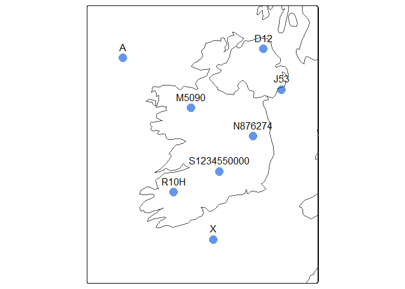
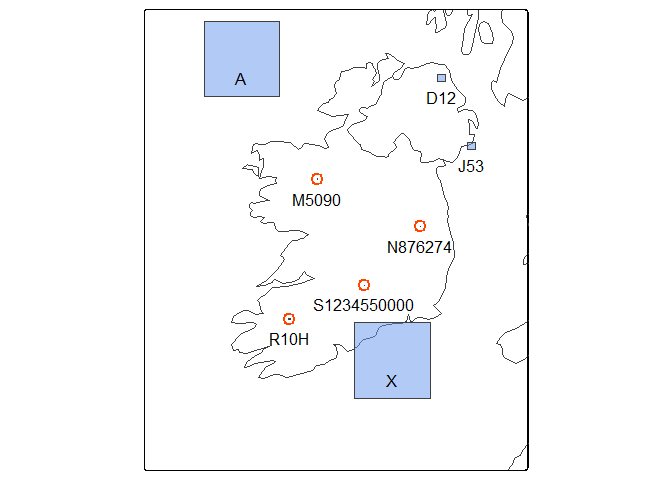

<!-- README.md is generated from README.Rmd. Please edit that file -->

# igr: Irish Grid References in R 

<!-- badges: start -->

[](https://lifecycle.r-lib.org/articles/stages.html#experimental)
<!-- [](https://CRAN.R-project.org/package=igr) -->
[](https://github.com/digitalnature-ie/igr/actions/workflows/R-CMD-check.yaml)
[](https://github.com/digitalnature-ie/igr/actions/workflows/test-coverage.yaml)
[](https://app.codecov.io/gh/digitalnature-ie/igr?branch=main)
<!-- badges: end -->

Convert between Irish grid references and Irish Grid coordinates or an
sf object.

An Irish grid reference consists of a letter, optionally followed by an
easting and northing. Each Irish grid reference refers to a square on
the Irish Grid ([EPSG:29903](https://epsg.io/29903)). A letter alone
(e.g. “N”) refers to a particular 100 km square. An Irish grid reference
with a 1-digit easting and northing (e.g. “N85”) refers to a 10 km
square. A 5-digit easting and northing (e.g. “N 12345 67890”) refers to
a 1 m square.

This package supports all resolutions of Irish grid reference, mixes of
resolutions, and Irish grid references with or without whitespace
between letter, easting and northing.

When converting Irish grid refrences to point locations (using
`igr_to_ig()`, or `st_igr_as_sf()` with the default `polygons=FALSE`),
the south west corners of the relevant Irish Grid squares are returned.
When converting to polygons (using `st_igr_as_sf()` with
`polygons=TRUE`), the polygons returned span the entire square of each
grid reference.

The functions `st_igr_as_sf()` and `st_irishgridrefs()` convert to and
from [sf](https://r-spatial.github.io/sf/) (simple feature) objects in
any coordinate reference system.

## Installation

To install the development version of igr:

``` r
# Install devtools package if needed
install.packages("devtools")

# Load devtools package if needed
library(devtools)     

# Install development version of igr package from github
install_github("digitalnature-ie/igr")
```

## Usage

To convert from Irish grid references:

- `igr_to_ig()` converts from a vector of Irish grid references to a
  matrix of Irish Grid coordinates
- `st_igr_as_sf()` converts from a data.frame containing Irish grid
  references to an sf object containing points or polygons

To convert to Irish grid references:

- `ig_to_igr()` converts from a list or matrix of Irish Grid coordinates
  to Irish grid references
- `st_irishgridrefs()` converts from an sf object to Irish grid
  references

### Convert from Irish grid references

``` r
library(igr)

# Sample grid references
igrs <- c("A", "D12", "J53", "M5090", "N876274", "S1234550000", "W")

# Converting to Irish Grid coordinates
igr_to_ig(igrs)
#> $x
#> [1]      0 310000 350000 150000 287600 212345 100000
#> 
#> $y
#> [1] 400000 420000 330000 290000 227400 150000      0
```

``` r
# Sample grid references in a data.frame
igrs_df <- data.frame(igr = igrs)

# Converting to an sf object of POINT features
st_igr_as_sf(igrs_df, "igr")
#> Simple feature collection with 7 features and 1 field
#> Geometry type: POINT
#> Dimension:     XY
#> Bounding box:  xmin: 0 ymin: 0 xmax: 350000 ymax: 420000
#> Projected CRS: TM75 / Irish Grid
#>           igr              geometry
#> 1           A       POINT (0 4e+05)
#> 2         D12 POINT (310000 420000)
#> 3         J53 POINT (350000 330000)
#> 4       M5090 POINT (150000 290000)
#> 5     N876274 POINT (287600 227400)
#> 6 S1234550000 POINT (212345 150000)
#> 7           W       POINT (1e+05 0)
```



``` r
# Converting to an sf object of POLYGON features
st_igr_as_sf(igrs_df, "igr", polygon = TRUE)
#> Simple feature collection with 7 features and 1 field
#> Geometry type: POLYGON
#> Dimension:     XY
#> Bounding box:  xmin: 0 ymin: 0 xmax: 360000 ymax: 5e+05
#> Projected CRS: TM75 / Irish Grid
#>           igr                       geometry
#> 1           A POLYGON ((1e+05 5e+05, 1e+0...
#> 2         D12 POLYGON ((320000 430000, 32...
#> 3         J53 POLYGON ((360000 340000, 36...
#> 4       M5090 POLYGON ((151000 291000, 15...
#> 5     N876274 POLYGON ((287700 227500, 28...
#> 6 S1234550000 POLYGON ((212346 150001, 21...
#> 7           W POLYGON ((2e+05 1e+05, 2e+0...
```



### Convert to Irish grid references

``` r
# Sample Irish Grid coordinates
p <- matrix(c(0, 490000, 400000, 0, 453000, 4000), ncol = 2, byrow = TRUE)
colnames(p) <- c("x", "y")

p
#>           x      y
#> [1,]      0 490000
#> [2,] 400000      0
#> [3,] 453000   4000
```

``` r
# Convert to Irish grid references
ig_to_igr(p)
#> [1] "A000900" "Z000000" "Z530040"
```

``` r
# Sample Irish Grid coordinates in an sf object
p_sf <- sf::st_as_sf(data.frame(p), crs = 29903, coords = c("x", "y"))

# Convert sf object to Irish grid references
st_irishgridrefs(p_sf, sep = " ")
#> [1] "A 000 900" "Z 000 000" "Z 530 040"
```

``` r
# Append Irish grid references to original sf object (using base R)
p_sf$igr <- st_irishgridrefs(p_sf)

# Append Irish grid references to original sf object (using tidy R)
p_sf <- p_sf |>
  dplyr::mutate(igr = st_irishgridrefs(p_sf))
```
