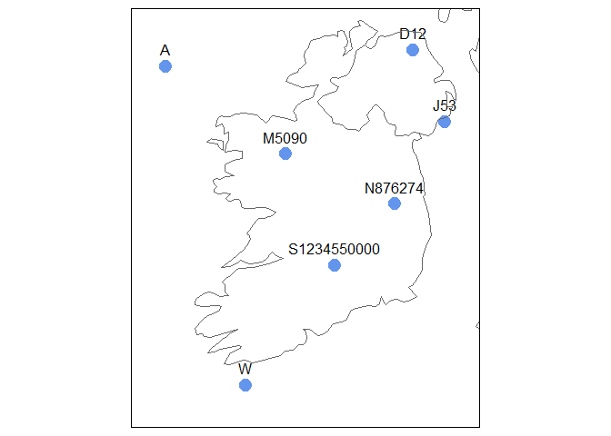
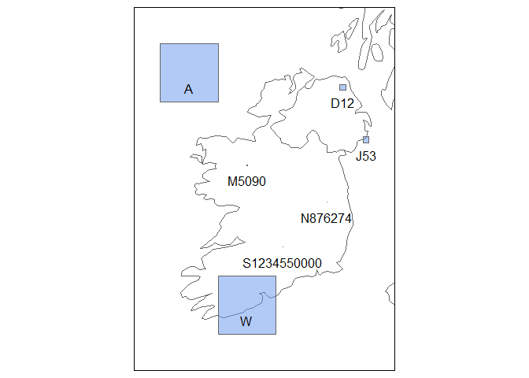

<!-- README.md is generated from README.Rmd. Please edit that file -->

# igr

<!-- badges: start -->

[](https://lifecycle.r-lib.org/articles/stages.html#experimental)
[](https://CRAN.R-project.org/package=igr)
[](https://github.com/digitalnature-ie/igr/actions/workflows/R-CMD-check.yaml)
[](https://github.com/digitalnature-ie/igr/actions/workflows/test-coverage.yaml)
[](https://app.codecov.io/gh/digitalnature-ie/igr?branch=main)
<!-- badges: end -->

Convert Irish Grid References to Irish Grid coordinates or a simple
feature object in any coordinate reference system, and vice versa.

## Installation

You can install the development version of igr like so:

``` r
# FILL THIS IN! HOW CAN PEOPLE INSTALL YOUR DEV PACKAGE?
```

## Converting from Irish Grid References

Convert Irish Grid References to Irish Grid coordinates:

``` r
library(igr)

igrs <- c("A", "C12", "J53", "N8090", "S1234550000", "V")

igr_to_ig(igrs)
#> $x
#> [1]      0 210000 350000 280000 212345      0
#> 
#> $y
#> [1] 400000 420000 330000 290000 150000      0
```

Convert Irish Grid References to sf object of points in the Irish Grid
coordinate reference system:

``` r
p_sf <- st_igr_as_sf(data.frame(igr = igrs), "igr")

p_sf
#> Simple feature collection with 6 features and 1 field
#> Geometry type: POINT
#> Dimension:     XY
#> Bounding box:  xmin: 0 ymin: 0 xmax: 350000 ymax: 420000
#> Projected CRS: TM75 / Irish Grid
#>           igr              geometry
#> 1           A       POINT (0 4e+05)
#> 2         C12 POINT (210000 420000)
#> 3         J53 POINT (350000 330000)
#> 4       N8090 POINT (280000 290000)
#> 5 S1234550000 POINT (212345 150000)
#> 6           V           POINT (0 0)
```

Plot the results:

``` r
library(maps)
library(tmap)

ie_uk_sf <- maps::map("world", 
                      regions = c("Ireland", "UK"), 
                      plot = FALSE, 
                      fill = TRUE) |>
  sf::st_as_sf(ie_uk) |>
  sf::st_transform(29903)

tm_shape(p_sf, ext = 1.2) +
  tm_dots(size = 1, col = "cornflowerblue") +
  tm_text("igr", ymod = 1) +
  tm_shape(ie_uk_sf) +
  tm_borders()
```



Convert Irish Grid References to sf object of polygons in the Irish Grid
coordinate reference system:

``` r
s_sf <- st_igr_as_sf(data.frame(igr = igrs), "igr", polygons = TRUE)

s_sf
#> Simple feature collection with 6 features and 2 fields
#> Geometry type: POLYGON
#> Dimension:     XY
#> Bounding box:  xmin: 0 ymin: 0 xmax: 360000 ymax: 5e+05
#> Projected CRS: TM75 / Irish Grid
#>           igr   res                       geometry
#> 1           A 1e+05 POLYGON ((1e+05 5e+05, 1e+0...
#> 2         C12 1e+04 POLYGON ((220000 430000, 22...
#> 3         J53 1e+04 POLYGON ((360000 340000, 36...
#> 4       N8090 1e+03 POLYGON ((281000 291000, 28...
#> 5 S1234550000 1e+00 POLYGON ((212346 150001, 21...
#> 6           V 1e+05 POLYGON ((1e+05 1e+05, 1e+0...
```

Plot the results:

``` r
tm_shape(ie_uk_sf, bbox = s_sf, ext = 1.2) +
  tm_borders() +
  tm_shape(s_sf, ext = 1.2) +
  tm_polygons(size = 1, col = "cornflowerblue", alpha = 0.5) +
  tm_text("igr", ymod = -1)
```



## Converting to Irish Grid References

Starting with a list of Irish Grid coordinates:

``` r
p <- list(x = c(0, 490000), y = c(400000, 0))

ig_to_igr(p)
#> [1] "A000000" "Z900000"
```

``` r
ig_to_igr(p, sep = " ")
#> [1] "A 000 000" "Z 900 000"
```

``` r
ig_to_igr(p, digits = 1)
#> [1] "A00" "Z90"
```

Starting with an sf object:

``` r
p_sf <- sf::st_as_sf(data.frame(p),
  crs = 29903,
  coords = c("x", "y")
)

st_irishgridrefs(p_sf)
#> [1] "A000000" "Z900000"
```

``` r
st_irishgridrefs(p_sf, sep = " ")
#> [1] "A 000 000" "Z 900 000"
```

``` r
st_irishgridrefs(p_sf, digits = 1)
#> [1] "A00" "Z90"
```
